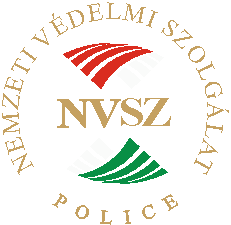
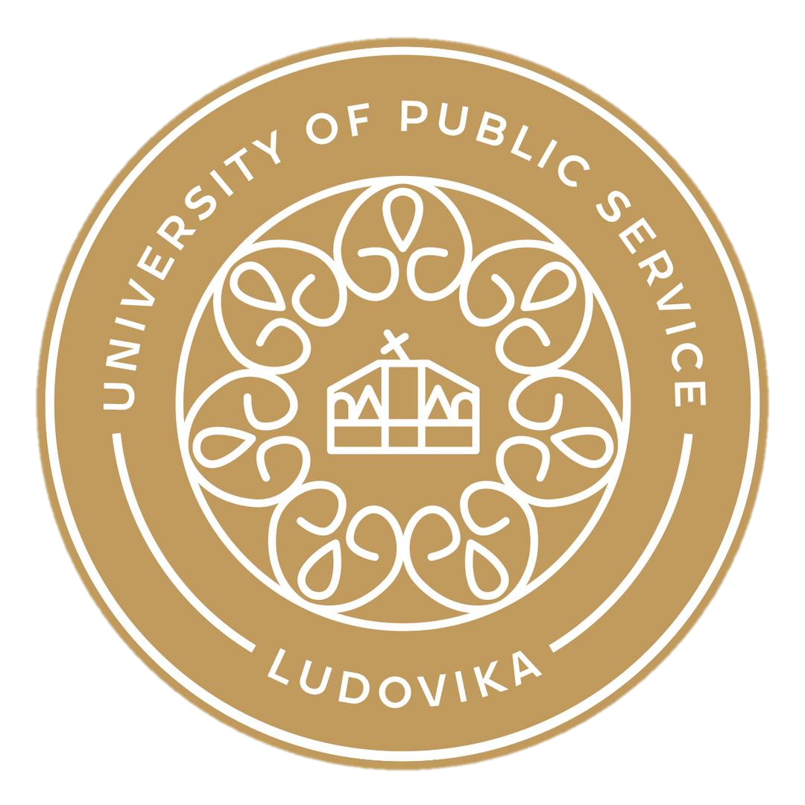

# [International Anti-Corruption Day][iacd]

| 🇮🇹 |
| :-: |
| *Giornata internazionale contro la corruzione* |

It's observed annually on **December 9th** to mark the anniversary of the
[Convention](#united-nations-convention-against-corruption-uncac).

The day's purpose is to raise public awareness about corruption and to highlight
the role of the Convention in combating and preventing it.

This year's theme, as it was last year, is: **Uniting with Youth Against
Corruption: Shaping Tomorrow's Integrity**.

| Where | When |
| :-: | :-: |
| [Ludovika University of Public Service](#ludovika-university-of-public-service-nke) | December 9, 2025 |

> [!NOTE]
>
> The [hungarian team][team-hu] was selected based on a national competition.

## [United Nations][un-en] (UN)

| 🇮🇹 |
| :-: |
| *[Organizzazione delle Nazioni Unite][un-it] (ONU)* |

| Secretary-General |
| :-: |
| António Guterres |

TODO

### [United Nations Office on Drugs and Crime][unodc] (UNODC)

| 🇮🇹 |
| :-: |
| *Ufficio delle Nazioni Unite sulla Droga e il Crimine* |

| Executive Director |
| :-: |
| Ghada Waly |

TODO

#### [United Nations Convention Against Corruption][uncac] (UNCAC)

It's the only legally binding, universal anti-corruption treaty. It provides a
comprehensive framework for member states to prevent and combat corruption in
both the public and private sectors.

It was adopted on October 31, 2003 by the United Nations General Assembly. It
was later signed on December 9, 2003 and entered into force on December 14,
2005\. Italy ratified it with the *Law 116/2009*.

> This Convention shall be open to all States for signature from 9 to 11
> December 2003 in **Merida, Mexico**, and thereafter at United Nations
> Headquarters in **New York** until 9 December 2005.
>
> <small><i>~ art. 67, par. 1 UNCAC</i></small>

It's subdiveded into eight chapters:
1. **General provisions**;
1. **Preventive measures**:
   - *"Preventive anti-corruption body or bodies" (art. 6)*;
   - *"Codes of conduct for public officials" (art. 8)*;
   - *"Public procurement and management of public finances" (art. 9)*.
1. **Criminalization and law enforcement**:
   - *"Bribery of national public officials" (art. 15)*;
   - *"Embezzlement, misappropriation or other diversion of property by a public
     official" (art. 17)*;
   - *"Trading in influence" (art. 18)*;
   - *"Abuse of functions" (art. 19)*;
   - *"Illicit enrichment" (art. 20)*.
1. **International cooperation**:
   - *"Extradition" (art. 44)*;
   - *"Mutual legal assistance" (art. 46)*;
   - *"Law enforcement cooperation" (art. 48)*.
1. **Asset recovery**, it establishes the principle that **stolen assets should
   be returned to their country of origin**;
1. **Technical assistance and information exchange**, this chapter ensures that
   countries, particularly developing nations, receive the support they need to
   implement the Convention. This includes:
   - providing training and technical assistance for law enforcement, judiciary,
     and anti-corruption agencies;
   - sharing best practices, research, and information on how to effectively
     combat corruption.
1. **Mechanisms for implementation**:
   - *"Conference of the States Parties to the Convention" (art. 63)*, its main
     goal is to improve the capacity of countries to implement the Convention
     and to promote cooperation among them.
1. **Final provisions**.

It has been ratified by most UN member states, with 192 parties, giving it
near-universal adherence.

The UN Office on Drugs and Crime (UNODC) in Vienna serves as the secretariat for
the Convention.

## Hungary's National Protective Service *(NVSZ)*

| 🇮🇹 | 🇭🇺 |
| :-: | :-: |
| *Servizio Nazionale di Protezione dell'Ungheria* | [*Nemzeti Védelmi Szolgálat*][nvsz] |

| Director General |
| :-: |
| Pol. Major General Dr. Szilvia Tomin |

It's an internal security government agency.

Unlike more traditional ingelligence services, such as counter-espionage, the
NVSZ operates mainly as an internal affairs and anti-corruption organization. It
was established in 2011 and operates under the Hungarian Ministry of Interior.

Its key responsibilities include:
- **anti-corruption**: its main mission is to prevent, detect and investigate
  crimes of corruption, abuse of office and influence peddling *(traffico di
  influenze)* committed by government personnel;
- **internal control**: it acts as an internal control body for a wide range of
  state agencies, known as "protected organizations";
- **information gathering**, including covert data collection, specifically
  targeted at crime prevention within state institutions.

The internal control function is achieved with mechanisms such as:
1. **integrity testing**, it's authorized to conduct tests to assess reliability
   and loyalty of public employees and law enforcement members, often using
   simulated scenarios to test their reaction to corruption attempts;
1. **lifestyle monitoring**, a proactive monitoring function, in fact the NVSZ
   is authorized to monitor the lifestyles of officers and public servants to
   see if they are living "beyond their means".

It also has a **protection** function, meaning it provides physical protection
and takes action if a member of the "protected staff" (or their family) is
threatened, attacked, or targeted as a result of performing their official
duties.

## Italian National Anticorruption Authority *(ANAC)*

| 🇮🇹 |
| :-: |
| [*Autorità Nazionale Anticorruzione*][anac] |

| President |
| :-: |
| Avv. Giuseppe Busia |

It is an independent Italian administrative authority. Its main task is to
prevent corruption within the public administration, ensure transparency and
impartiality of public officials, and supervise the proper execution of public
contracts.

Therefore the key points about it are:
- **corruption prevention**: it develops strategies and National Anti-Corruption
  Plans that individual public administrations must adopt;
- **transparency**: it ensures that public administrations publish data and
  documents (such as budgets, executive salaries, tender procedures *(procedure
  di gara)*) to make them accessible to citizens;
- **public contracts**: it oversees the entire public procurement sector to
  ensure that procedures are legal, fair, and not subject to criminal
  infiltration or corruption. It manages the National Database of Public
  Contracts *(BDNCP)*;
- **powers**: it has regulatory powers (issuing guidelines), supervisory powers,
  and the power to impose sanctions in cases of violations of transparency or
  procurement rules;
- **whistleblowing**: it manages reports of wrongdoing (known as whistleblowing)
  from public employees, guaranteeing their confidentiality.

## Guardia di Finanza's Special Anti-Corruption Unit

| 🇮🇹 |
| :-: |
| *Nucleo Speciale Anticorruzione della Guardia di Finanza* |

| Commander |
| :-: |
| Brigadier General Giovanni Salerno |

It's a specialized department of the Guardia di Finanza (GdiF), which is Italy's
financial police force.

While [ANAC](#italian-national-anticorruption-authority-anac) is an independent
administrative authority focused primarily on prevention and regulation, the
GdiF's Special Anti-Corruption Unit is a judicial police body focused on the
repression of crimes.

Its main tasks are:
- **complex investigations**: it conducts judicial police investigations focused
  on serious crimes against the Public Administration, such as corruption,
  extortion by a public official, embezzlement[^1] *(appropriazione indebita)*,
  and abuse of office;
- **ANAC's operational arm**: it acts as the primary investigative arm for ANAC.
  When ANAC, during its administrative monitoring activities, identifies facts
  that may constitute a crime, it reports them to the Public Prosecutor's Office
  and relies on the Special Anti-Corruption Unit for the criminal investigation;
- **public spending oversight**: it carries out checks and investigations into
  the illicit use of public funds, including both national and EU funds;
- **collaboration with prosecutors**: it works closely with the Public
  Prosecutor's offices and the National Anti-Mafia and Anti-Terrorism
  Directorate *(DNAA)* on the most significant corruption-related
  investigations.

Its relationship with ANAC is detailed in a special *memorandum* of
understanding.

## [Ludovika University of Public Service][nke] *(NKE)*

| 🇮🇹 | 🇭🇺 |
| :-: | :-: |
| *Università Nazionale dei Servizi Pubblici di Budapest* | *Nemzeti Közszolgálati Egyetem* |

| Rector |
| :-: |
| Dr. Gergely Deli |

It's a specialized, state-run institution and serves as the primary educational
and research center for public service and state-building[^2].

Its core mission is to educate and train professionals for careers in public
administration, law enforcement, the military, and international affairs. It
also has a unique, specialized focus on water sciences.

The university's academic structure is built around its distinct professional
fields. Its main faculties include:
- **Faculty of Public Governance and International Studies** (FPGIS): focuses on
  training civil servants and diplomats. Programs often cover international
  relations, public management, and european studies;
- **Faculty of Military Sciences and Officer Training** (FMSOT): educates the
  next generation of professional officers for the Hungarian Defence Forces;
- **Faculty of Law Enforcement** (FLE): provides training for police officers
  and other law enforcement personnel, with specializations in areas like
  criminal investigation, economic crime, and border policing;
- **Faculty of Water Sciences** (FWS): a unique faculty (located in Baja,
  Hungary) dedicated to water diplomacy, water resource management, and civil
  engineering related to water.

While the modern university was officially founded in 2012 (through the merger
of several existing institutions), it traces its heritage to the Royal Hungarian
Ludovika Academy. This original military academy was founded in 1808.

The university's main Ludovika Campus in Budapest is a prominent landmark,
featuring the fully restored historic academy building alongside modern
educational and sporting facilities.

## [International Anti-Corruption Academy][iaca] (IACA)

TODO: hungary is part of it, not italy

[^1]: Its the misappropriation when the property or funds involved have been
      lawfully entrusted to the embezzler. In circumstances where the funds are
      accessible to, but not entrusted to, the perpetrator, it is not
      embezzlement but can still be considered larceny, misappropriation,
      misapplication, or some other similar term.

[^2]: The practical process of creating, strengthening, and professionalizing
      the core institutions that a country needs to function effectively.

[anac]: https://www.anticorruzione.it
[iaca]: https://www.iaca.int
[iacd]: https://www.unodc.org/unodc/en/anticorruptionday/index.html
[nke]: https://en.uni-nke.hu
[nvsz]: https://www.nvsz.hu
[team-hu]: https://corruptionprevention.gov.hu/national-law-enforcement-competition-in-the-spirit-of-corruption-prevention
[un-en]: https://www.un.org/en/
[un-it]: https://unric.org/it/
[uncac]: https://www.unodc.org/documents/brussels/UN_Convention_Against_Corruption.pdf
[unodc]: https://www.unodc.org
