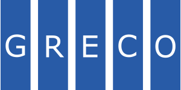
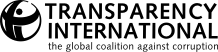
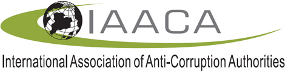
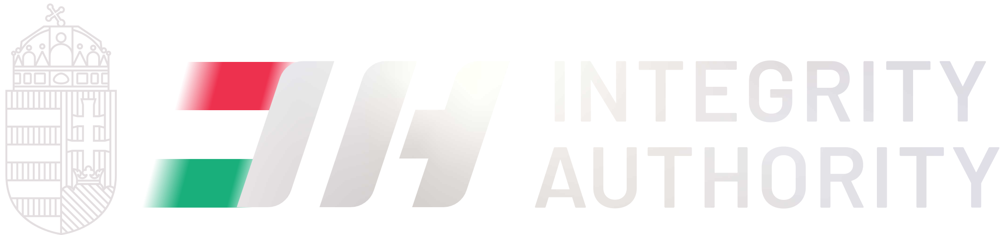
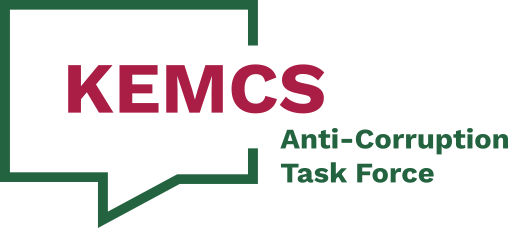
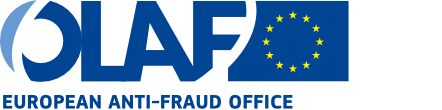

# [International Anti-Corruption Day][iacd]

| 🇮🇹 |
| :-: |
| *Giornata internazionale contro la corruzione* |

It's observed annually on **December 9th** to mark the anniversary of the
[Convention](#united-nations-convention-against-corruption-uncac).

The day's purpose is to raise public awareness about corruption and to highlight
the role of the Convention in combating and preventing it.

This year's theme, as it was last year, is: **Uniting with Youth Against
Corruption: Shaping Tomorrow's Integrity**.

| Where | When |
| :-: | :-: |
| [Ludovika University of Public Service](#ludovika-university-of-public-service-nke) | December 9, 2025 |

> [!NOTE]
>
> The [hungarian team][team-hu] was selected based on a national competition.

## [United Nations][un-en] (UN)

| 🇮🇹 |
| :-: |
| *[Organizzazione delle Nazioni Unite][un-it] (ONU)* |

| Secretary-General |
| :-: |
| António Guterres |

TODO

### [United Nations Office on Drugs and Crime][unodc] (UNODC)

| 🇮🇹 |
| :-: |
| *Ufficio delle Nazioni Unite sulla Droga e il Crimine* |

| Executive Director |
| :-: |
| Ghada Waly |

It's a United Nations office dedicated to addressing the interrelated issues of
illicit drugs, transnational organized crime, corruption, and terrorism. It
serves as the global leader in these areas, mandated to assist Member States in
making the world safer from these threats.

It was established in 1997.

Its headquarters are in Vienna, Austria, and it operates through an extensive
network of field offices worldwide.

The mission of the UNODC is to contribute to global peace and security, human
rights, and development. It achieves this through three main pillars of work:
1. research and analysis: it conducts extensive global research to monitor and
   analyze drug and crime trends. Its most famous publication is the annual
   World Drug Report, which provides a comprehensive assessment of the
   international drug problem. This research helps to identify emerging threats
   and provide an evidence base for policy;
1. normative work (policy and treaties): it works to help countries ratify and
   implement key international treaties. It serves as the guardian of crucial UN
   conventions, including:
   - the UN Convention against Transnational Organized Crime (UNTOC) and its
     protocols (on human trafficking, migrant smuggling, and firearms);
   - the [UN Convention against
     Corruption](#united-nations-convention-against-corruption-uncac) (UNCAC);
   - the three international drug control conventions.
1. technical cooperation (field operations): it provides practical,
   on-the-ground technical assistance and capacity-building to Member States.
   This includes:
   - training police officers, border guards, prosecutors, and judges;
   - helping to reform justice and prison systems;
   - supporting drug use prevention, treatment, and care programs;
   - developing sustainable alternative livelihoods for farmers who cultivate
     illicit crops.

The UNODC focuses its efforts on several key areas:
- **countering organized crime**: this includes fighting human trafficking
  (promoted through its Blue Heart Campaign), migrant smuggling, wildlife and
  forest crime, and firearms trafficking;
- **addressing the world drug problem**: this involves efforts in drug use
  prevention and treatment, as well as countering illicit drug trafficking and
  production;
- **fighting corruption**: it's the lead UN entity for anti-corruption, helping
  countries implement the [UN Convention against
  Corruption](#united-nations-convention-against-corruption-uncac) (UNCAC);
- **terrorism prevention**: it works to strengthen the capacity of national
  criminal justice systems to prevent and counter terrorism in compliance with
  the rule of law;
- **crime prevention and criminal justice**: this area focuses on improving
  access to justice, promoting prison reform, and preventing violence.

#### [United Nations Convention Against Corruption][uncac] (UNCAC)

It's the only legally binding, universal anti-corruption treaty. It provides a
comprehensive framework for member states to prevent and combat corruption in
both the public and private sectors.

It was adopted on October 31, 2003 by the United Nations General Assembly. It
was later signed on December 9, 2003 and entered into force on December 14,
2005\. Italy ratified it with the *Law 116/2009*.

> This Convention shall be open to all States for signature from 9 to 11
> December 2003 in **Merida, Mexico**, and thereafter at United Nations
> Headquarters in **New York** until 9 December 2005.
>
> <small><i>~ art. 67, par. 1 UNCAC</i></small>

It's subdiveded into eight chapters:
1. **General provisions**;
1. **Preventive measures**:
   - *"Preventive anti-corruption body or bodies" (art. 6)*;
   - *"Codes of conduct for public officials" (art. 8)*;
   - *"Public procurement and management of public finances" (art. 9)*.
1. **Criminalization and law enforcement**:
   - *"Bribery of national public officials" (art. 15)*;
   - *"Embezzlement, misappropriation or other diversion of property by a public
     official" (art. 17)*;
   - *"Trading in influence" (art. 18)*;
   - *"Abuse of functions" (art. 19)*;
   - *"Illicit enrichment" (art. 20)*.
1. **International cooperation**:
   - *"Extradition" (art. 44)*;
   - *"Mutual legal assistance" (art. 46)*;
   - *"Law enforcement cooperation" (art. 48)*.
1. **Asset recovery**, it establishes the principle that **stolen assets should
   be returned to their country of origin**;
1. **Technical assistance and information exchange**, this chapter ensures that
   countries, particularly developing nations, receive the support they need to
   implement the Convention. This includes:
   - providing training and technical assistance for law enforcement, judiciary,
     and anti-corruption agencies;
   - sharing best practices, research, and information on how to effectively
     combat corruption.
1. **Mechanisms for implementation**:
   - *"Conference of the States Parties to the Convention" (art. 63)*, its main
     goal is to improve the capacity of countries to implement the Convention
     and to promote cooperation among them.
1. **Final provisions**.

It has been ratified by most UN member states, with 192 parties, giving it
near-universal adherence.

The [UN Office on Drugs and
Crime](#united-nations-office-on-drugs-and-crime-unodc) (UNODC) serves as the
secretariat for the Convention.

## Hungary's National Protective Service *(NVSZ)*

| 🇮🇹 | 🇭🇺 |
| :-: | :-: |
| *Servizio Nazionale di Protezione dell'Ungheria* | [*Nemzeti Védelmi Szolgálat*][nvsz] |

| Director General |
| :-: |
| Pol. Major General Dr. Szilvia Tomin |

It's an internal security government agency.

Unlike more traditional ingelligence services, such as counter-espionage, the
NVSZ operates mainly as an internal affairs and anti-corruption organization. It
was established in 2011 and operates under the Hungarian Ministry of Interior.

Its key responsibilities include:
- **anti-corruption**: its main mission is to prevent, detect and investigate
  crimes of corruption, abuse of office and influence peddling *(traffico di
  influenze)* committed by government personnel;
- **internal control**: it acts as an internal control body for a wide range of
  state agencies, known as "protected organizations";
- **information gathering**, including covert data collection, specifically
  targeted at crime prevention within state institutions.

The internal control function is achieved with mechanisms such as:
1. **integrity testing**, it's authorized to conduct tests to assess reliability
   and loyalty of public employees and law enforcement members, often using
   simulated scenarios to test their reaction to corruption attempts;
1. **lifestyle monitoring**, a proactive monitoring function, in fact the NVSZ
   is authorized to monitor the lifestyles of officers and public servants to
   see if they are living "beyond their means".

It also has a **protection** function, meaning it provides physical protection
and takes action if a member of the "protected staff" (or their family) is
threatened, attacked, or targeted as a result of performing their official
duties.

## Italian National Anticorruption Authority *(ANAC)*

| 🇮🇹 |
| :-: |
| [*Autorità Nazionale Anticorruzione*][anac] |

| President |
| :-: |
| Dr. Giuseppe Busia |

It is an independent Italian administrative authority. Its main task is to
prevent corruption within the public administration, ensure transparency and
impartiality of public officials, and supervise the proper execution of public
contracts.

Therefore the key points about it are:
- **corruption prevention**: it develops strategies and National Anti-Corruption
  Plans that individual public administrations must adopt;
- **transparency**: it ensures that public administrations publish data and
  documents (such as budgets, executive salaries, tender procedures *(procedure
  di gara)*) to make them accessible to citizens;
- **public contracts**: it oversees the entire public procurement sector to
  ensure that procedures are legal, fair, and not subject to criminal
  infiltration or corruption. It manages the National Database of Public
  Contracts *(BDNCP)*;
- **powers**: it has regulatory powers (issuing guidelines), supervisory powers,
  and the power to impose sanctions in cases of violations of transparency or
  procurement rules;
- **whistleblowing**: it manages reports of wrongdoing (known as whistleblowing)
  from public employees, guaranteeing their confidentiality.

## Guardia di Finanza's Special Anti-Corruption Unit

| 🇮🇹 |
| :-: |
| *Nucleo Speciale Anticorruzione della Guardia di Finanza* |

| Commander |
| :-: |
| Brigadier General Giovanni Salerno |

It's a specialized department of the Guardia di Finanza (GdiF), which is Italy's
financial police force.

While [ANAC](#italian-national-anticorruption-authority-anac) is an independent
administrative authority focused primarily on prevention and regulation, the
GdiF's Special Anti-Corruption Unit is a judicial police body focused on the
repression of crimes.

Its main tasks are:
- **complex investigations**: it conducts judicial police investigations focused
  on serious crimes against the Public Administration, such as corruption,
  extortion by a public official, embezzlement[^1] *(appropriazione indebita)*,
  and abuse of office;
- **ANAC's operational arm**: it acts as the primary investigative arm for ANAC.
  When ANAC, during its administrative monitoring activities, identifies facts
  that may constitute a crime, it reports them to the Public Prosecutor's Office
  and relies on the Special Anti-Corruption Unit for the criminal investigation;
- **public spending oversight**: it carries out checks and investigations into
  the illicit use of public funds, including both national and EU funds;
- **collaboration with prosecutors**: it works closely with the Public
  Prosecutor's offices and the National Anti-Mafia and Anti-Terrorism
  Directorate *(DNAA)* on the most significant corruption-related
  investigations.

Its relationship with ANAC is detailed in a special *memorandum* of
understanding *(protocollo d'intesa)*.

## [Ludovika University of Public Service][nke] *(NKE)*

| 🇮🇹 | 🇭🇺 |
| :-: | :-: |
| *Università Nazionale dei Servizi Pubblici di Budapest* | *Nemzeti Közszolgálati Egyetem* |

| Rector |
| :-: |
| Dr. Gergely Deli |

It's a specialized, state-run institution and serves as the primary educational
and research center for public service and state-building[^2].

Its core mission is to educate and train professionals for careers in public
administration, law enforcement, the military, and international affairs. It
also has a unique, specialized focus on water sciences.

The university's academic structure is built around its distinct professional
fields. Its main faculties include:
- **Faculty of Public Governance and International Studies** (FPGIS): focuses on
  training civil servants and diplomats. Programs often cover international
  relations, public management, and european studies;
- **Faculty of Military Sciences and Officer Training** (FMSOT): educates the
  next generation of professional officers for the Hungarian Defence Forces;
- **Faculty of Law Enforcement** (FLE): provides training for police officers
  and other law enforcement personnel, with specializations in areas like
  criminal investigation, economic crime, and border policing;
- **Faculty of Water Sciences** (FWS): a unique faculty (located in Baja,
  Hungary) dedicated to water diplomacy, water resource management, and civil
  engineering related to water.

While the modern university was officially founded in 2012 (through the merger
of several existing institutions), it traces its heritage to the Royal Hungarian
Ludovika Academy. This original military academy was founded in 1808.

The university's main Ludovika Campus in Budapest is a prominent landmark,
featuring the fully restored historic academy building alongside modern
educational and sporting facilities.

## [International Anti-Corruption Academy][iaca] (IACA)

| Hungary 🇭🇺 | Italy 🇮🇹 | Croatia 🇭🇷 | Germany 🇩🇪 | Romania 🇷🇴 |
| :-: | :-: | :-: | :-: | :-: |
| &#9989; | &#10060; | &#9989; | &#10060; | &#9989; |

| Dean and Executive Secretary |
| :-: |
| Professor Slagjana Taseva |

It's based in Laxenburg, Austria, just south of Vienna.

It was launched in 2010 and became a formal international organization on March
8, 2011.

The Academy was initiated by a partnership including the [United Nations Office
on Drugs and Crime](#united-nations-office-on-drugs-and-crime-unodc) (UNODC),
INTERPOL, the European Anti-Fraud Office (OLAF), and the Republic of Austria.

Its constituency includes over 70 UN Member States and several international
organizations.

It's an international, intergovernmental organization and a post-secondary
educational institution. It is the first global institution of its kind with a
mandate dedicated exclusively to a comprehensive approach to fighting
corruption.

IACA's primary mission is to overcome the current shortcomings in
anti-corruption knowledge and practice. It aims to empower professionals and
practitioners from all sectors to effectively implement the
[UNCAC](#united-nations-convention-against-corruption-uncac).

IACA's work is centered around three main **pillars**:
1. **academic degree programmes**, it offers postgraduate programs, including a
   Master in Anti-Corruption Studies (MACS) and an International Master in
   Anti-Corruption Compliance (IMACC). These programs are designed for
   professionals from the public and private sectors, as well as from civil
   society and academia;
1. **professional training**:
   - tailor-made trainings: customized programs for specific organizations,
     governments, or companies;
   - open trainings: standardized courses and workshops on various
     anti-corruption and compliance topics;
   - online courses: A mix of instructor-led and self-paced courses available to
     a global audience.
1. **research and networking**, the Academy serves as a think-tank, conducting
   research on corruption and compliance trends. It hosts international
   conferences, webinars, and events, creating a global network for
   anti-corruption experts to share best practices and challenges.

## [Group of States against Corruption][greco] *(GRECO)*

| 🇮🇹 | 🇫🇷 |
| :-: | :-: |
| *Gruppo di Stati contro la corruzione* | *Groupe d'Etats contre la corruption* |

It was established in 1999 by the **Council of Europe** to monitor States'
compliance with the organisation's anti-corruption standards.

GRECO's objective is to improve the capacity of its members to fight corruption
by monitoring their compliance with Council of Europe anti-corruption standards
through a dynamic process of mutual evaluation and peer pressure. It helps to
identify deficiencies in national anti-corruption policies, prompting the
necessary legislative, institutional and practical reforms. GRECO also provides
a platform for the sharing of best practice in the prevention and detection of
corruption.

## [Transparency International][ti]

It's a global non-governmental organization (NGO) dedicated to combating
corruption. It is one of the world's most prominent anti-corruption
organizations.

Founded in 1993 and headquartered in Berlin, Germany, it operates as a global
movement with a network of independent national chapters in over 100 countries.

> **Vision**
>
> To see a world in which government, politics, business, civil society, and the
> daily lives of people are free of corruption.

> **Mission**
>
> To stop corruption and promote transparency, accountability, and integrity at
> all levels and across all sectors of society.

It does not investigate or expose individual cases of corruption. Instead, it
focuses on systemic issues and long-term solutions. Its main activities include:
- **advocacy**: pushing for national and international anti-corruption reforms,
  laws, and conventions (such as the
  [UNCAC](#united-nations-convention-against-corruption-uncac));
- **research and publications**: producing influential reports, indexes, and
  tools that measure and highlight corruption;
- **building coalitions**: working with governments, businesses, and other civil
  society groups to implement anti-corruption measures;
- **empowering citizens**: running Advocacy and Legal Advice Centres (ALACs) in
  many countries, which provide free and confidential legal advice to witnesses
  and victims of corruption.

It's best known for its two main annual reports:
1. **Corruption Perceptions Index** (CPI): this is TI's flagship publication. It
   is one of the most widely used indicators of public sector corruption
   worldwide.

   It ranks 180 countries and territories by their perceived levels of public
   sector corruption.

   It is a "composite index" that aggregates data from numerous surveys and
   assessments of corruption, as **perceived by business executives and country
   experts**.

   It uses a scale of 0 to 100, where 100 is "very clean" and 0 is
   "highly corrupt";
2. **Global Corruption Barometer** (GCB), unlike the CPI, which relies on expert
   opinion, it **surveys ordinary citizens**.

   It asks for citizens' direct, personal experiences with corruption in their
   daily lives (e.g., "Have you paid a bribe in the last 12 months?").

   It is the world's largest public opinion survey on corruption, providing a
   "ground-level" view of how corruption affects people and which institutions
   they perceive as most corrupt.

## [International Association of Anti-Corruption Authorities][iaaca] (IAACA)

| President | Vice President (1 of 3) |
| :-: | :-: |
| Mr. Danny Y M Woo | Dr. Giuseppe Busia |

| 🇮🇹 | 🇭🇺 |
| :-: | :-: |
| [ANAC](#italian-national-anticorruption-authority-anac) | [Integrity Authority](#hungarys-integrity-authority) |

It's an independent, non-political global organization for the agencies and
officials responsible for fighting corruption.

Established in 2006 in Beijing, China, the IAACA serves as a global network for
anti-corruption authorities (ACAs) worldwide.

The primary objective of the IAACA is to promote the effective implementation of
the [UNCAC](#united-nations-convention-against-corruption-uncac).

It functions as a central platform for anti-corruption authorities to
collaborate, share best practices, and support each other in the global fight
against corruption.

Unlike [Transparency International](#transparency-international) (an NGO) or
[GRECO](#group-of-states-against-corruption-greco) (a regional monitoring body),
the IAACA is a professional association for the anti-corruption bodies
themselves. Its main activities include:
- **promoting international cooperation**: facilitating direct cooperation
  between member agencies on practical matters, such as mutual legal assistance,
  asset recovery, and extradition;
- **exchanging expertise**: organizing annual conferences, general meetings, and
  specialized training workshops where prosecutors, investigators, and
  prevention specialists can share successful strategies and technical
  expertise;
- **capacity building**: assisting in the development and strengthening of
  anti-corruption authorities, particularly in developing countries;
- **networking**: creating a global network of anti-corruption professionals to
  foster direct and informal communication.

IAACA's membership is not composed of countries (like GRECO) but of the national
anti-corruption authorities (ACAs) themselves.

It brings together institutions responsible for investigation, prosecution, and
prevention of corruption from around the world.

The association has over 170 member agencies.

The Presidency and Secretariat are currently held by the Independent Commission
Against Corruption (ICAC) of Hong Kong SAR (Special Administrative Region),
China.

## Hungary's [Integrity Authority][ia]

| 🇭🇺 |
| :-: |
| *Integritás Hatóság* |

It's an autonomous state administrative body established in 2022 with the
specific mandate to oversee the use of European Union funds in the country.

Its creation was a central part of a package of anti-corruption reforms demanded
by the European Commission. It was a key "remedial measure" intended to address
systemic rule-of-law *(stato di diritto)* and corruption concerns that had led
the EU to freeze billions of euros in cohesion and recovery funds designated for
Hungary.

The Authority officially began its operations on November 19, 2022.

The Integrity Authority's mission is not to act as a general, all-purpose
anti-corruption agency. Its mandate is strictly focused on protecting the EU's
financial interests.

Its main tasks include:
- **monitoring EU funds**: overseeing all planned, ongoing, or completed
  projects that receive partial or full funding from the European Union;
- **prevention and detection**: working to prevent, detect, and correct
  instances of fraud, conflicts of interest, corruption, and other legal
  irregularities related to the management of these funds;
- **conducting investigations**: it can initiate investigations based on its own
  findings or on reports and complaints from any person, including anonymous
  whistleblowers;
- **intervention powers**: the Authority has the power to:
  - instruct contracting authorities (like government agencies) to suspend
    public procurement procedures if it suspects wrongdoing;
  - request information and data from other state bodies;
  - issue binding recommendations and, if they are not followed, refer the
    matter to a court.
- **reporting**: it publishes annual integrity reports and risk assessments of
  Hungary's public procurement system;
- **referring cases**: it can refer suspected criminal cases to Hungarian law
  enforcement, the European Anti-Fraud Office (OLAF), or the European Public
  Prosecutor's Office (EPPO) (which Hungary is not a member of, but the
  Authority can cooperate with).

The Authority's work is supported by an [Anti-Corruption Task
Force](#anti-corruption-task-force-kemcs).

### [Anti-Corruption Task Force][kemcs-en] *(KEMCS)*

| 🇭🇺 |
| :-: |
| *Korrupcióellenes Munkacsoport* |

This is a consultative body chaired by the President of the [Integrity
Authority](#hungarys-integrity-authority), composed of 21 members—half from
government and state institutions, and half from non-governmental civil society,
including anti-corruption watchdogs like [Transparency
International](#transparency-international) Hungary.

It was established in December 2022.

Its official role is not to investigate or prosecute specific cases of
corruption. Instead, it operates for an indefinite time, carrying out
analytical, proposal, opinion-forming, and decision-preparation tasks.

Its main tasks include:
- analyzing the government's existing anti-corruption measures;
- developing proposals and recommendations to improve the prevention, detection,
  and sanctioning of corruption;
- preparing an annual report that assesses the state of corruption and the
  effectiveness of anti-corruption policies in Hungary.

## [Organisation for Economic Co-operation and Development][oecd] (OECD)

| 🇮🇹 |
| :-: |
| *Organizzazione per la cooperazione e lo sviluppo economico (OCSE)* |

TODO

### [Convention on Combating Bribery of Foreign Public Officials in International Business Transactions][oecd-bribery-convention]

TODO

## [European Anti-Fraud Office][olaf] *(OLAF)*

| 🇮🇹 | 🇫🇷 |
| :-: | :-: |
| *Ufficio europeo per la lotta antifrode* | *Office européen de Lutte Anti-Fraude* |

TODO

[^1]: Its the misappropriation when the property or funds involved have been
      lawfully entrusted to the embezzler. In circumstances where the funds are
      accessible to, but not entrusted to, the perpetrator, it is not
      embezzlement but can still be considered larceny, misappropriation,
      misapplication, or some other similar term.

[^2]: The practical process of creating, strengthening, and professionalizing
      the core institutions that a country needs to function effectively.

[anac]: https://www.anticorruzione.it
[greco]: https://www.coe.int/en/web/greco/home
[ia]: https://integritashatosag.hu/en/
[iaaca]: https://www.iaaca.net
[iaca]: https://www.iaca.int
[iacd]: https://www.unodc.org/unodc/en/anticorruptionday/index.html
[kemcs-en]: https://kemcs.hu/en/
[nke]: https://en.uni-nke.hu
[nvsz]: https://www.nvsz.hu
[oecd]: https://www.oecd.org
[oecd-bribery-convention]: https://legalinstruments.oecd.org/en/instruments/OECD-LEGAL-0293
[olaf]: https://anti-fraud.ec.europa.eu/index_en
[team-hu]: https://corruptionprevention.gov.hu/national-law-enforcement-competition-in-the-spirit-of-corruption-prevention
[ti]: https://www.transparency.org/en
[un-en]: https://www.un.org/en/
[un-it]: https://unric.org/it/
[uncac]: https://www.unodc.org/documents/brussels/UN_Convention_Against_Corruption.pdf
[unodc]: https://www.unodc.org
